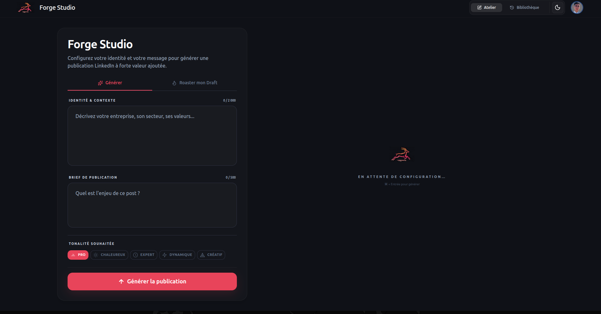
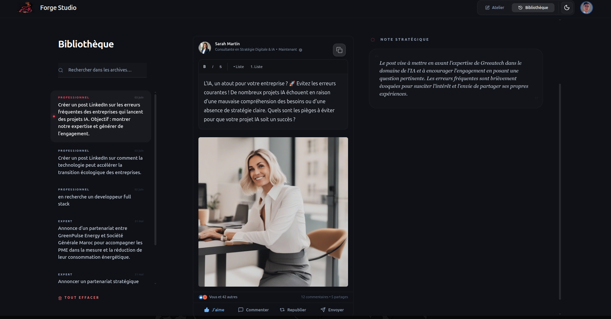
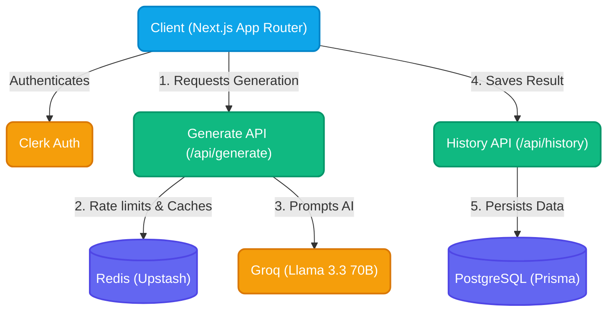

# Forge Studio — LinkedIn Content Generator

🔗 **[Accéder à l'application en ligne](https://linked-in-generator-seven.vercel.app/)** | 📄 **[Consulter le rapport de restitution (PDF)](./Restitution/restitution_linkedin_studio.pdf)**

Forge Studio est une application web dédiée à la génération stratégique de contenus pour LinkedIn. Interface soignée, prompts structurés, authentification Clerk et historique persisté en base PostgreSQL.

## Aperçu


_Interface principale de génération_


_Résultat avec note d'intention stratégique_


_Historique des générations (par utilisateur)_

## Fonctionnalités

- **Studio de génération** — Modes Générer, Roast et Améliorer (feedback itératif)
- **Conformité LinkedIn** — Validation Zod (entrée + sortie IA, max 1300 caractères)
- **Note d'intention** — Transparence sur les choix éditoriaux de l'IA
- **Authentification** — Clerk (sign-in / sign-up)
- **Historique cloud** — PostgreSQL via Prisma, isolé par `userId`
- **Sécurité API** — `/api/generate` réservé aux utilisateurs connectés
- **Rate limiting** — 10 requêtes / minute / utilisateur (Upstash Redis en prod, mémoire en local)
- **Cache** — Réponses identiques mises en cache 1 h (Redis ou mémoire)

## Stack technique

| Composant          | Technologie                           |
| ------------------ | ------------------------------------- |
| Framework          | Next.js 16 (App Router)               |
| Langage            | TypeScript (strict)                   |
| Auth               | Clerk                                 |
| Base de données    | PostgreSQL + Prisma                   |
| Cache / rate limit | Upstash Redis (optionnel en local)    |
| IA                 | Groq — Llama 3.3 70B                  |
| Validation         | Zod + React Hook Form                 |
| UI                 | Tailwind CSS, Framer Motion, Radix UI |
| Tests              | Vitest + Testing Library              |
| CI                 | GitHub Actions (pnpm)                 |

## Architecture



```
│   ├── api/generate/     # Génération IA (auth Clerk, rate limit, cache, Zod)
│   ├── api/history/      # CRUD historique utilisateur
│   ├── history/          # Page bibliothèque
│   ├── sign-in/          # Clerk
│   └── page.tsx          # Studio
├── components/           # UI (Form, Result, LinkedInPost, …)
├── lib/
│   ├── schemas.ts        # Schémas Zod (entrée, sortie, historique)
│   ├── prompt.ts         # Prompt engineering par mode
│   ├── cache.ts          # Cache Redis / mémoire
│   ├── rateLimit.ts      # Rate limit Redis / mémoire
│   ├── generateClient.ts # Client fetch vers /api/generate
│   └── db.ts             # Prisma singleton
├── prisma/               # Schéma + migrations
└── __tests__/            # Tests unitaires et API
```

## Démarrage local

### Prérequis

- Node.js 22+
- [pnpm](https://pnpm.io/) 10+
- Clé API [Groq](https://console.groq.com/)
- Application [Clerk](https://clerk.com/) + base PostgreSQL

### Installation

```bash
pnpm install
cp .env.example .env.local
# Renseigner GROQ_API_KEY, Clerk, DATABASE_URL, DIRECT_URL
pnpm exec prisma migrate dev
pnpm dev
```

Ouvrir [http://localhost:3000](http://localhost:3000).

### Variables d'environnement

| Variable                                              | Obligatoire | Description                   |
| ----------------------------------------------------- | ----------- | ----------------------------- |
| `GROQ_API_KEY`                                        | Oui         | Inférence Groq                |
| `NEXT_PUBLIC_CLERK_*` / `CLERK_SECRET_KEY`            | Oui         | Auth                          |
| `DATABASE_URL` / `DIRECT_URL`                         | Oui         | PostgreSQL                    |
| `UPSTASH_REDIS_REST_URL` / `UPSTASH_REDIS_REST_TOKEN` | Prod Vercel | Rate limit + cache distribués |

Sans Upstash, le dev local utilise un fallback en mémoire (non partagé entre instances serverless).

### Scripts

| Commande            | Description              |
| ------------------- | ------------------------ |
| `pnpm dev`          | Serveur de développement |
| `pnpm build`        | Build production         |
| `pnpm test`         | Tests Vitest             |
| `pnpm typecheck`    | Vérification TypeScript  |
| `pnpm lint`         | ESLint                   |
| `pnpm format:check` | Prettier                 |

## Qualité & CI/CD

Chaque push/PR sur `main` exécute :

1. `pnpm install --frozen-lockfile`
2. `prisma generate`
3. ESLint + Prettier
4. `tsc --noEmit`
5. Vitest
6. `next build` (clés placeholder en CI)

[Dependabot](.github/dependabot.yml) met à jour les dépendances npm et GitHub Actions chaque semaine.

### Déploiement (Vercel recommandé)

1. Lier le dépôt GitHub à Vercel
2. Configurer toutes les variables de `.env.example`
3. Ajouter Upstash Redis pour la production
4. Exécuter `prisma migrate deploy` (CLI ou job CI/CD post-deploy)

## Roadmap

- [ ] Publication directe via API LinkedIn (OAuth)
- [ ] RAG / voix utilisateur à partir de l'historique
- [ ] Tests E2E Playwright (flux auth + génération)
- [ ] Suppression d'une archive individuelle

---

_Conçu avec exigence pour les professionnels de la communication._
