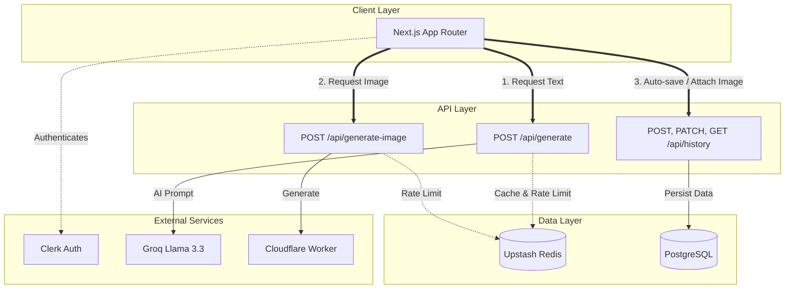

<div align="center">
  
  <h1>Forge Studio</h1>
  <p><strong>Le générateur stratégique de contenus LinkedIn propulsé par l'IA</strong></p>
  
  <p>
    <a href="https://linked-in-generator-seven.vercel.app/"><strong>Accéder à l'application en ligne</strong></a> ·
    <a href="./Restitution/restitution_linkedin_studio.pdf"><strong>Lire le rapport de restitution (PDF)</strong></a>
  </p>

  <p>
    
    
    
    
    
    
  </p>
</div>

<hr />

> **Forge Studio** est une application web dédiée à la génération stratégique de contenus pour LinkedIn. Interface soignée, prompts structurés, authentification Clerk, génération d'images via Cloudflare Workers, et historique auto-sauvegardé en base PostgreSQL.

## Aperçu de l'Interface

<details open>
<summary><b>Découvrir les écrans de l'application</b></summary>
<br>

|                               Studio Principal                                |                          Résultat & Intention Stratégique                           |                        Historique Utilisateur                         |
| :---------------------------------------------------------------------------: | :---------------------------------------------------------------------------------: | :-------------------------------------------------------------------: |
|  |  |  |

</details>

## Fonctionnalités Clés

- **IA Stratégique (Groq Llama 3.3)** — Modes _Générer_, _Roaster_ un brouillon et _Améliorer_ avec du feedback itératif.
- **Génération d'images (Cloudflare Workers)** — Création de visuels d'accompagnement réalistes.
- **Conformité LinkedIn** — Limite stricte des 1300 caractères garantie et structuration pour l'algorithme.
- 🔍 **Transparence Éditoriale** — Chaque post s'accompagne d'une "Note d'intention" expliquant les choix de l'IA.
- 🔐 **Authentification Sécurisée** — Intégration de Clerk (Sign-in / Sign-up / Gestion de compte).
- 💾 **Historique Cloud** — Auto-sauvegarde des publications en base PostgreSQL (via Prisma).
- ⚡ **Performances Extrêmes** — Rate-limiting (Upstash Redis) et Cache persistant.

## Stack Technique

| Catégorie                     | Technologies Utilisées                      |
| ----------------------------- | ------------------------------------------- |
| **Core**                      | Next.js (App Router), React 19, TypeScript  |
| **Styling**                   | Tailwind CSS, Framer Motion, Radix UI       |
| **Backend & BDD**             | PostgreSQL, Prisma ORM                      |
| **Auth & Sécurité**           | Clerk, Upstash Redis (Rate limiting)        |
| **Intelligence Artificielle** | Groq (Llama 3.3 70B), Cloudflare Workers AI |
| **Outils & Qualité**          | Zod, React Hook Form, Vitest, Docker        |

## Architecture Technique



## Déploiement Local (Docker Recommandé)

Le projet est entièrement configuré pour tourner de manière isolée via Docker, incluant une base de données PostgreSQL locale et un mock Upstash Redis.

### Prérequis

- Docker & Docker Compose
- Clé API [Groq](https://console.groq.com/)
- Compte [Clerk](https://clerk.com/)

### Lancement Rapide

**1. Cloner et configurer l'environnement**

```bash
cp .env.example .env.local
```

_(Éditez `.env.local` pour y ajouter vos clés Clerk et Groq. Les variables PostgreSQL et Redis seront gérées automatiquement par Docker)._

**2. Démarrer les conteneurs**

```bash
docker compose up --build -d
```

**3. Initialiser la base de données (1ère exécution seulement)**
Dans votre terminal, lancez la synchronisation Prisma :

```bash
docker compose exec app pnpm exec prisma db push
```

L'application est maintenant disponible sur [http://localhost:3000](http://localhost:3000) ! 🎉

## Démarrage Local (Classique / Sans Docker)

Si vous préférez exécuter le projet sans Docker directement sur votre machine :

```bash
# 1. Installation des dépendances
pnpm install

# 2. Configuration (Renseignez DATABASE_URL vers un Postgres distant comme Supabase)
cp .env.example .env.local

# 3. Synchronisation de la Base de Données
npx dotenv-cli -e .env.local -- prisma db push

# 4. Lancement du serveur
pnpm dev
```

## Variables d'environnement

| Variable                            | Obligatoire | Description                                    |
| ----------------------------------- | :---------: | ---------------------------------------------- |
| `GROQ_API_KEY`                      |     ✅      | Clé pour l'inférence texte Groq                |
| `NEXT_PUBLIC_CLERK_PUBLISHABLE_KEY` |     ✅      | Clé publique Clerk (Auth)                      |
| `CLERK_SECRET_KEY`                  |     ✅      | Clé privée Clerk (Auth)                        |
| `DATABASE_URL`                      |     ✅      | Connexion PostgreSQL (Prisma)                  |
| `CF_IMAGE_WORKER_URL`               |     ❌      | URL de votre Cloudflare Worker (Images)        |
| `UPSTASH_REDIS_REST_URL`            |     ❌      | URL Redis (Optionnel en local, Requis en Prod) |

## Qualité Code & CI/CD

Chaque push ou Pull Request sur la branche `main` déclenche un workflow GitHub Actions rigoureux :

1. Installation propre via `pnpm install --frozen-lockfile`
2. Linting (ESLint + Prettier)
3. Typechecking strict (`tsc --noEmit`)
4. Tests Unitaires (`vitest`)
5. Dry-run du Build Next.js

## Roadmap Évolutive

- [ ] **Publication Directe** — Intégration de l'API LinkedIn OAuth pour publier en 1 clic.
- [ ] **Voix Utilisateur (RAG)** — Utilisation de l'historique pour affiner le style de l'IA (Fine-tuning du prompt).
- [ ] **Stockage Externe** — Migration des images Base64 vers AWS S3 / R2.
- [ ] **Tests E2E** — Validation des flux complexes via Playwright.

---

<p align="center">
  <i>Conçu avec exigence pour les professionnels de la communication.</i>
</p>
