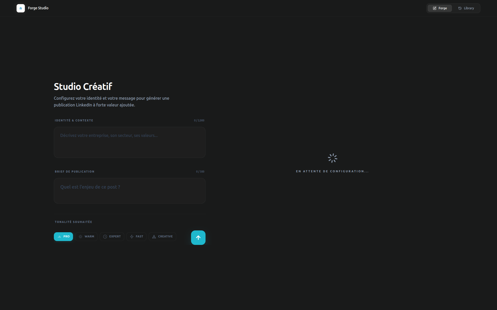
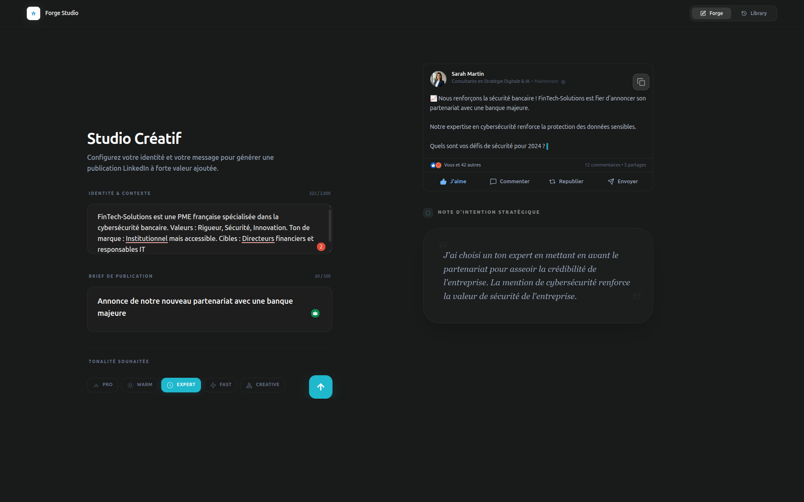
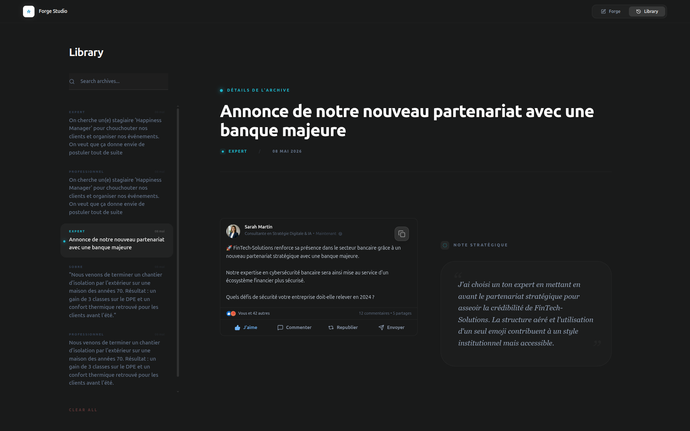

# LinkedIn Content Studio — Forge Studio

Solution web de haute précision pour la génération de contenus LinkedIn stratégiques. Ce projet combine une interface utilisateur minimaliste avec une ingénierie de prompt avancée pour transformer des briefs d'entreprise en publications professionnelles prêtes à l'emploi.

## Aperçu du Studio







## Principes Directeurs

- Ergonomie Zen : Une interface sombre (Dark Mode) conçue pour minimiser les distractions et maximiser la productivité éditoriale.
- Intégrité des Données : Validation stricte via Zod garantissant que chaque sortie respecte les limites techniques de LinkedIn (1 300 caractères).
- Transparence Algorithmique : Chaque génération est accompagnée d'une note d'intention expliquant les choix de tonalité, de structure et d'angle d'attaque.
- Sécurité Native : Architecture isolant les clés API côté serveur pour prévenir toute exposition.

## Architecture Technique

- Coeur Logiciel : Next.js 14 (App Router)
- Typage : TypeScript (Strict Mode)
- Design System : Vanilla CSS & Tailwind CSS
- Dynamisme : Framer Motion
- Moteur IA : Groq / Llama 3 (Inférence ultra-rapide)
- Reporting : ReportLab (Moteur de rendu PDF professionnel)

## Guide de Démarrage

### Studio de Génération (Web)

1. Installation
   ```bash
   npm install
   ```

2. Configuration
   Créez un fichier .env.local :
   ```env
   GROQ_API_KEY=votre_cle_api_groq
   ```

3. Exécution
   ```bash
   npm run dev
   ```

### Générateur de Restitution (PDF)

Pour produire le document technique de restitution :

1. Environnement
   ```bash
   conda create -n pdf-gen python=3.10
   conda activate pdf-gen
   pip install reportlab
   ```

2. Génération
   ```bash
   python generate_restitution.py
   ```

## Roadmap & Évolutions

1. Persistance Distante : Migration vers PostgreSQL/Supabase pour synchroniser l'historique multi-appareils.
2. Publication Directe : Intégration de l'OAuth LinkedIn pour poster sans quitter le studio.
3. Intelligence Augmentée : Mise en œuvre d'un système RAG (Retrieval-Augmented Generation) pour apprendre le style spécifique de l'utilisateur sur la base de ses publications passées.